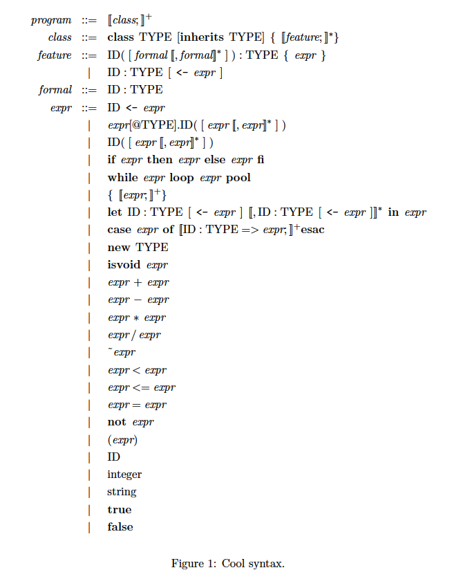

# The COOL compiler

The current project contains a runtime library (please see the runtime folder), which define several functions for IO and string manipulation, and a compiler which compile COOL program to x64(intel) assembly.

## Syntax

## I have only tested my compiler on MAC OX X with python 3.

To use this compiler please make sure you do the following steps:

1. navigate to the folder(the root folder) which contains all the python file.
2. then run the command `python3 main.py <filename>.cl`, this will generate the assembly file `<filename>.s` in the root folder
3. run 
    `clang(or gcc) runtime.c startup.s <filename>.s -o <filename>` 
to generate binary file
3. run `./<filename>` to see the result.

#### The current compiler did not implement the following features due to time constraint.

1. case expression
2. null pointer dereference detection and handling.
3. no garbage collector
4. no optimization

I also did not get the chance to properly test my compiler so I will demonstate this compiler with a few examples.
  
  
## Design note:

The code generator runs the program in two pass.

### 1. It collect global data, such as what does prototype object for each class looks like. We need to predefine a prototype object for each class so when we do `new className` in COOL program we will do `Object_copy`(see startup.s in the runtime folder), all the new object will be allocated on the heap.

Each class object has the following fileds in order:

            tag  -- use to differantiate different class
            object size
            dispatch table
            attribute 1
            attribute 2
            ...

The offset of each attribute from the base will be collected at compile time. Moreover, if a class B inheit class A, then all A's attirbutes will be copied and put before B's attributes.

The first pass always also information in order to generate dispatch table for each class. There are a few things that can be handled by the code generator:

    i. if the child class overwrite one of the method defined in the parent class. Then the parent-method will not 
       appear in child's dispatch table. For example:
       
       Class A {
           
           m1 (){}
           m2 (){}
           toString() {}
       }
       
       class B {
       
           m2 () {}
       }
       
       then the dispatch table for both class will look like this:
       
       .dispatch_A:
           .A_m1
           .A_m2
           .A_toString
           
       .dispatch_B:
           .A_m1
           .B_m2
           .A_toString
           
       the offset of each method is known at compiled time so the order might be different.
       
### 2. In the second pass, the compiler recursively walks through the AST and generate x64 code. At the same time whenever it sees a string or int or bool, it will put them into different table for latter use. The reason why I have different table for string, int and bool is becasue in COOL, everything is an object even for primitive type.

Whenever we see a string, we check if its value is in the string table. If it is not, we generate a string constant label for it, then put it into the table and use string value as the key, and string label as the value. If it is in the table, then we do use the respective label as reference.